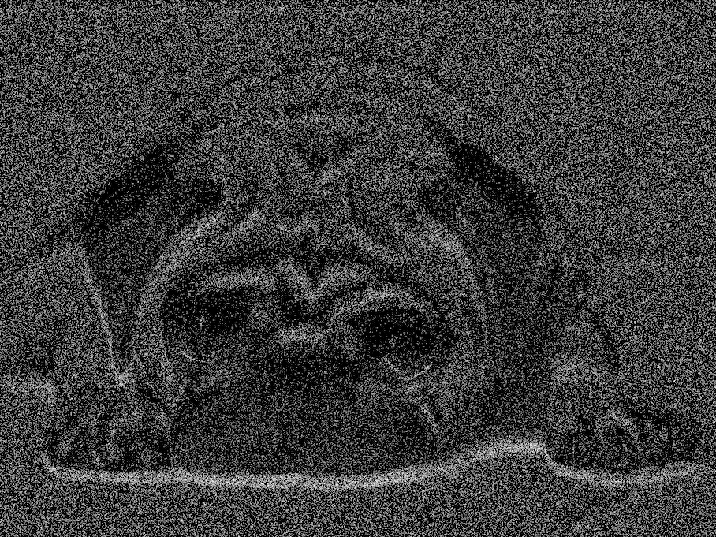
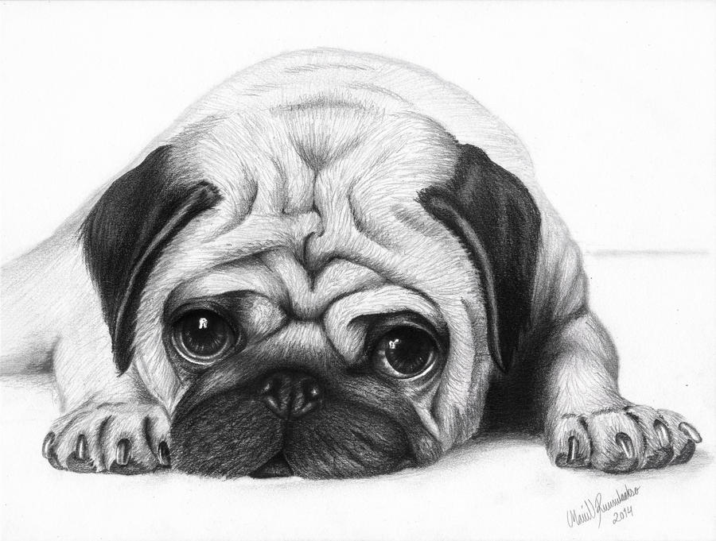

# life-of-boids rust part

See https://github.com/hpwxf/cpp-life-of-boids for C++ part.

Particle pugs                                     |  Original pugs
:------------------------------------------------:|:------------------------------------:
 | 

